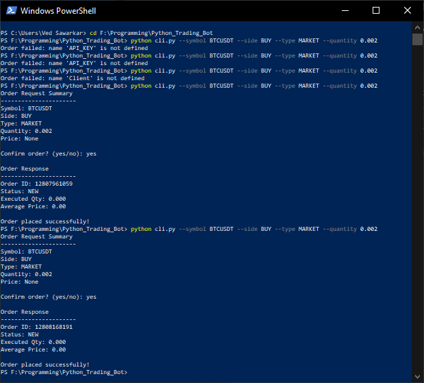

# Binance Futures Testnet Trading Bot

A simple Python CLI trading bot that places MARKET and LIMIT orders on Binance Futures Testnet.

---

## Features

- Place MARKET orders on Binance Futures Testnet
- Place LIMIT orders on Binance Futures Testnet
- Supports BUY and SELL operations
- CLI interface using argparse
- Structured architecture (API layer + CLI layer)
- Input validation
- Error handling
- Logging of API requests, responses, and failures
- Order confirmation prompt before execution

---

## Project Structure

trading_bot/
│
├── bot/
│   ├── client.py
│   ├── orders.py
│   ├── validators.py
│   └── logging_config.py
│
├── cli.py
├── requirements.txt
├── README.md
└── logs/

---

## Setup

### 1 Install dependencies

pip install -r requirements.txt

### 2 Create .env file

Add your Binance Testnet API keys:

BINANCE_API_KEY=your_key
BINANCE_SECRET_KEY=your_secret

---

## Example Commands

### MARKET Order

python cli.py --symbol BTCUSDT --side BUY --type MARKET --quantity 0.002

### LIMIT Order

python cli.py --symbol BTCUSDT --side SELL --type LIMIT --quantity 0.002 --price 68000

---

## Logging

Logs are saved in:

logs/trading_bot.log

Logs include:

- Order requests
- Order responses
- Errors

## Example CLI Output

